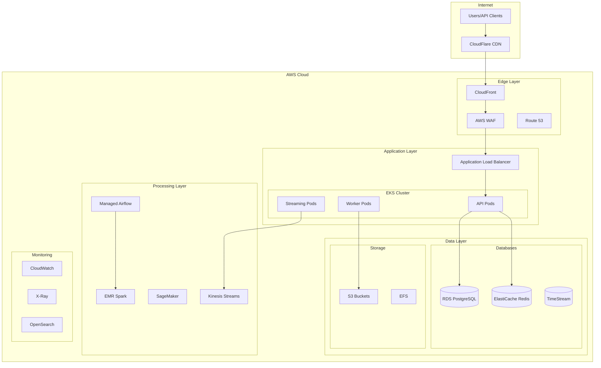

# Cloud Architecture Design - Kopitar NHL Analytics Platform

## Executive Summary
The Kopitar platform requires a robust, scalable cloud infrastructure to support:
- Processing 40+ years of historical NHL data
- Real-time streaming for live games
- Machine learning model training and inference
- High-availability API serving thousands of concurrent users
- Cost-effective storage for ~150GB+ of data

## Cloud Provider Selection

### Recommended: AWS (Amazon Web Services)
**Rationale:**
- Mature ecosystem with all required services
- Strong machine learning capabilities (SageMaker)
- Excellent geographical coverage for low latency
- Cost-effective at scale
- Superior monitoring and observability tools

### Alternative: Google Cloud Platform (GCP)
**Advantages:**
- Better BigQuery for analytics
- Superior Kubernetes engine
- Competitive ML offerings

### Multi-Cloud Strategy
- **Primary**: AWS for core infrastructure
- **Secondary**: CloudFlare for CDN and edge computing
- **Failover**: GCP for disaster recovery

## Architecture Overview



## Detailed Service Architecture

### 1. Network Architecture

#### VPC Design
```yaml
Production VPC:
  CIDR: 10.0.0.0/16
  Regions: us-east-1 (primary), us-west-2 (DR)
  
  Availability Zones: 3 (us-east-1a, us-east-1b, us-east-1c)
  
  Subnets:
    Public:
      - 10.0.1.0/24 (ALB, NAT Gateway)
      - 10.0.2.0/24
      - 10.0.3.0/24
    
    Private:
      - 10.0.11.0/24 (EKS Nodes)
      - 10.0.12.0/24
      - 10.0.13.0/24
    
    Database:
      - 10.0.21.0/24 (RDS)
      - 10.0.22.0/24
      - 10.0.23.0/24
```

#### Security Groups
```yaml
API_Security_Group:
  Inbound:
    - Port 443 from ALB
    - Port 80 from ALB
  Outbound:
    - All traffic

Database_Security_Group:
  Inbound:
    - Port 5432 from API_Security_Group
    - Port 6379 from API_Security_Group
  Outbound:
    - None

Worker_Security_Group:
  Inbound:
    - None
  Outbound:
    - All traffic (for external APIs)
```

### 2. Compute Infrastructure

#### Amazon EKS (Elastic Kubernetes Service)
```yaml
EKS Cluster:
  Name: kopitar-prod-cluster
  Version: 1.28
  
  Node Groups:
    api-nodes:
      Instance Type: t3.large
      Min Size: 3
      Max Size: 20
      Desired Size: 6
      
    worker-nodes:
      Instance Type: c5.2xlarge
      Min Size: 2
      Max Size: 10
      Desired Size: 4
      
    streaming-nodes:
      Instance Type: m5.xlarge
      Min Size: 2
      Max Size: 8
      Desired Size: 3
```

#### Auto Scaling Configuration
```yaml
Horizontal Pod Autoscaler:
  API Service:
    Min Replicas: 3
    Max Replicas: 50
    Target CPU: 70%
    Target Memory: 80%
    
  Worker Service:
    Min Replicas: 2
    Max Replicas: 20
    Scale on Queue Length: 100 messages
    
Cluster Autoscaler:
  Enabled: true
  Scale Down Delay: 10 minutes
  Max Node Provision Time: 15 minutes
```

### 3. Data Storage Architecture

#### Amazon RDS PostgreSQL
```yaml
Primary Database:
  Engine: PostgreSQL 15
  Instance Class: db.r6g.2xlarge
  Storage: 1TB GP3 SSD
  IOPS: 12,000
  Multi-AZ: Yes
  
  Read Replicas:
    - us-east-1b (db.r6g.xlarge)
    - us-east-1c (db.r6g.xlarge)
  
  Backup:
    Retention: 30 days
    Window: 03:00-04:00 UTC
    
  Maintenance:
    Window: Sun 04:00-05:00 UTC
```

#### Amazon ElastiCache Redis
```yaml
Redis Cluster:
  Node Type: cache.r6g.xlarge
  Nodes: 3
  Shards: 3
  Replicas per Shard: 2
  
  Features:
    - Cluster Mode: Enabled
    - Multi-AZ: Yes
    - Automatic Failover: Yes
    - Backup: Daily snapshots
```

#### Amazon S3 Buckets
```yaml
Buckets:
  kopitar-raw-data:
    Purpose: Raw NHL API responses
    Lifecycle:
      - Transition to IA after 30 days
      - Archive to Glacier after 90 days
    
  kopitar-processed-data:
    Purpose: Transformed data
    Lifecycle:
      - Transition to IA after 60 days
    
  kopitar-ml-models:
    Purpose: Trained ML models
    Versioning: Enabled
    
  kopitar-backups:
    Purpose: Database backups
    Replication: Cross-region to us-west-2
```

#### Amazon Timestream
```yaml
Time Series Database:
  Database: kopitar-metrics
  
  Tables:
    player_performance:
      Memory Retention: 24 hours
      Magnetic Retention: 2 years
      
    system_metrics:
      Memory Retention: 6 hours
      Magnetic Retention: 30 days
```

### 4. Data Processing Infrastructure

#### Amazon Managed Airflow
```yaml
Airflow Environment:
  Name: kopitar-airflow
  Size: mw1.large
  Min Workers: 2
  Max Workers: 10
  
  DAGs Storage: S3
  Logs Storage: CloudWatch
```

#### Amazon EMR (Spark Cluster)
```yaml
EMR Cluster:
  Release: emr-6.14.0
  
  Master Node:
    Instance Type: m5.xlarge
    Count: 1
    
  Core Nodes:
    Instance Type: m5.2xlarge
    Count: 3
    Auto Scaling: 3-10 nodes
    
  Applications:
    - Spark 3.4.1
    - Hadoop 3.3.3
    - Hive 3.1.3
```

#### Amazon Kinesis
```yaml
Data Streams:
  live-game-events:
    Shards: 10
    Retention: 24 hours
    
  player-updates:
    Shards: 5
    Retention: 24 hours
```

### 5. Machine Learning Infrastructure

#### Amazon SageMaker
```yaml
Training Infrastructure:
  Instance Types:
    - ml.p3.2xlarge (GPU for neural networks)
    - ml.m5.4xlarge (CPU for tree-based models)
    
  Training Jobs:
    Spot Instances: Yes (70% cost savings)
    Max Runtime: 24 hours
    
Inference Endpoints:
  fatigue-predictor:
    Instance Type: ml.m5.xlarge
    Instance Count: 2
    Auto Scaling: 2-5 instances
    
  performance-predictor:
    Instance Type: ml.m5.xlarge
    Instance Count: 2
    Auto Scaling: 2-5 instances
```

### 6. Content Delivery & Edge

#### CloudFront Distribution
```yaml
Distribution:
  Origins:
    - ALB (dynamic content)
    - S3 (static assets)
    
  Behaviors:
    /api/*: Forward to ALB
    /static/*: Serve from S3
    
  Caching:
    Default TTL: 0 (API responses)
    Static Assets TTL: 86400
    
  Geo Restriction: None
  Price Class: All Edge Locations
```

#### AWS WAF
```yaml
Web ACL Rules:
  - Rate Limit: 2000 requests/5min per IP
  - SQL Injection Protection
  - XSS Protection
  - Known Bad IPs Block List
  - Geo Blocking: None
```

### 7. Monitoring & Observability

#### CloudWatch Configuration
```yaml
Dashboards:
  - API Performance
  - Database Metrics  
  - ML Model Performance
  - Cost Analytics
  
Alarms:
  High Priority:
    - API Response Time > 500ms
    - Database CPU > 80%
    - Error Rate > 1%
    
  Medium Priority:
    - Queue Depth > 1000
    - ML Endpoint Latency > 200ms
    - Storage Usage > 80%
```

#### AWS X-Ray
```yaml
Tracing:
  Sampling Rate: 10%
  Service Map: Enabled
  
  Segments:
    - API Requests
    - Database Queries
    - External API Calls
    - ML Inference
```

#### OpenSearch (ELK)
```yaml
Domain:
  Instance Type: r5.large.search
  Instance Count: 3
  Storage: 500GB per node
  
  Indices:
    - application-logs
    - access-logs
    - error-logs
    - audit-logs
```

### 8. Security Architecture

#### AWS IAM Roles
```yaml
Roles:
  EKSNodeRole:
    - AmazonEKSWorkerNodePolicy
    - AmazonEKS_CNI_Policy
    - AmazonEC2ContainerRegistryReadOnly
    
  APIServiceRole:
    - RDS Access
    - S3 Read/Write (specific buckets)
    - Kinesis Write
    - X-Ray Write
    
  AirflowRole:
    - EMR Create/Manage
    - S3 Full Access
    - RDS Access
```

#### Secrets Management
```yaml
AWS Secrets Manager:
  Secrets:
    - Database Credentials
    - API Keys
    - JWT Secrets
    
  Rotation:
    Database Passwords: 90 days
    API Keys: 180 days
```

#### Encryption
```yaml
Encryption at Rest:
  RDS: AWS KMS (Customer Managed Key)
  S3: SSE-S3
  EBS: Encrypted by default
  
Encryption in Transit:
  TLS 1.3 everywhere
  Certificate Manager for SSL certs
```

### 9. Disaster Recovery

#### Backup Strategy
```yaml
RDS Backups:
  Automated: Daily
  Retention: 30 days
  Cross-Region: us-west-2
  
S3 Replication:
  Critical Buckets: Cross-region replication
  RPO: 15 minutes
  
Application State:
  Kubernetes: Velero backups to S3
  Frequency: Every 6 hours
```

#### Failover Plan
```yaml
RTO: 4 hours
RPO: 15 minutes

Failover Steps:
  1. Route 53 health check failure
  2. Automatic DNS failover to DR region
  3. Promote RDS read replica in DR
  4. Scale up EKS cluster in DR
  5. Restore Redis from snapshot
```

### 10. Cost Optimization

#### Reserved Instances
```yaml
RDS: 3-year term, All Upfront (60% savings)
EC2: 1-year term, Partial Upfront (40% savings)
ElastiCache: 1-year term, No Upfront (30% savings)
```

#### Spot Instances
```yaml
EMR Workers: 70% spot instances
ML Training: 100% spot instances
Non-critical workers: 50% spot instances
```

#### Cost Controls
```yaml
Budget Alerts:
  - 80% of monthly budget
  - 100% of monthly budget
  - Anomaly detection
  
Auto-shutdown:
  Development environments: Nights/weekends
  EMR clusters: After job completion
```

## Deployment Strategy

### Infrastructure as Code
```yaml
Tools:
  - Terraform for AWS resources
  - Helm for Kubernetes deployments
  - AWS CDK for complex constructs
  
GitOps:
  - ArgoCD for Kubernetes
  - GitHub Actions for CI/CD
  - Terraform Cloud for state management
```

### CI/CD Pipeline
```yaml
Build:
  - GitHub Actions
  - Docker build and push to ECR
  - Run tests in parallel
  
Deploy:
  Development: Automatic on merge to develop
  Staging: Automatic on merge to main
  Production: Manual approval required
  
Rollback:
  - Automated on failure
  - Blue/Green deployments
  - Canary releases for API
```

## Estimated Costs

### Monthly Cost Breakdown
```yaml
Compute:
  EKS Nodes: $800
  EMR (Spot): $300
  SageMaker: $400
  
Storage:
  RDS: $600
  S3: $200
  ElastiCache: $400
  
Network:
  Data Transfer: $300
  Load Balancer: $50
  CloudFront: $100
  
Other:
  Airflow: $300
  Monitoring: $200
  Backups: $100
  
Total: ~$3,750/month

Annual Reserved: ~$30,000 (40% savings)
```

## Security Compliance

### Standards
- SOC 2 Type II compliant architecture
- GDPR ready (data residency controls)
- PCI DSS capable (not required for public stats)

### Best Practices
- Least privilege access
- Network segmentation  
- Encryption everywhere
- Regular security audits
- Automated compliance scanning

## Monitoring SLAs

### Service Level Objectives
```yaml
API Availability: 99.9% (43 min/month downtime)
API Response Time: p95 < 200ms
Data Freshness: < 5 minutes for live games
ML Inference: p95 < 100ms
Pipeline Success Rate: > 99%
```

## Migration Plan

### Phase 1: Foundation (Week 1-2)
- Set up AWS accounts and IAM
- Create VPC and networking
- Deploy EKS cluster
- Set up RDS and Redis

### Phase 2: Core Services (Week 3-4)
- Deploy API services
- Set up Airflow
- Configure monitoring
- Implement CI/CD

### Phase 3: Data Migration (Week 5-6)
- Historical data backfill
- Set up streaming pipelines
- Deploy ML models
- Performance testing

### Phase 4: Production (Week 7-8)
- Security audit
- Load testing
- Disaster recovery testing
- Go-live

This cloud architecture provides a robust, scalable foundation for the Kopitar platform with high availability, strong security, and cost optimization built in from the start.