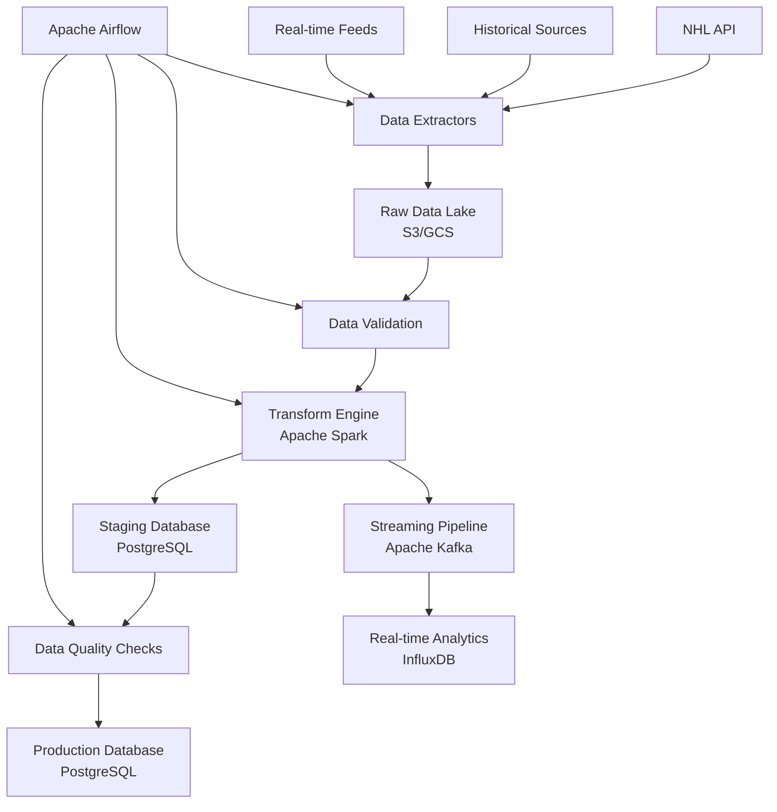

# ETL Architecture Design - Kopitar NHL Analytics Platform

## Overview
The Kopitar platform requires a sophisticated ETL (Extract, Transform, Load) architecture to handle:
- **40+ years of historical NHL data** (1980-2024)
- **Real-time game data** during live games 
- **Multi-source data ingestion** (NHL API, supplementary sources)
- **Complex transformations** for fatigue analysis and advanced metrics
- **High availability** and **fault tolerance**

## Architecture Components

### 1. Data Sources

#### Primary Source: NHL Stats API
```
https://statsapi.web.nhl.com/api/v1/
```
- **Rate Limit**: 100 requests/minute
- **Coverage**: 2010-present (full data)
- **Historical**: 1980-2009 (limited data)
- **Real-time**: Live game feeds, scores, events

#### Supplementary Sources
- **Hockey Reference** (historical stats pre-2010)
- **Natural Stat Trick** (advanced metrics)
- **Arena location data** (manually curated)
- **Weather APIs** (for travel impact analysis)
- **Flight tracking APIs** (for precise travel times)

### 2. ETL Pipeline Architecture



### 3. Data Flow Layers

#### Layer 1: Data Extraction
**Components**: Custom extractors, rate limiting, retry logic
**Technologies**: Python, asyncio, aiohttp, Redis (rate limiting)

```python
# Example extractor architecture
class NHLDataExtractor:
    async def extract_games(self, season: str, date_range: tuple)
    async def extract_players(self, team_ids: List[int])
    async def extract_live_feed(self, game_id: int)
    async def extract_play_by_play(self, game_id: int)
```

#### Layer 2: Raw Data Storage
**Components**: Data lake for raw, unprocessed data
**Technologies**: AWS S3 / Google Cloud Storage
**Structure**:
```
/raw-data/
  /nhl-api/
    /games/{season}/{game_id}/
    /players/{player_id}/
    /teams/{team_id}/
  /historical/
    /pre-2010/{season}/
  /real-time/
    /live-feeds/{date}/
```

#### Layer 3: Data Validation & Cleansing
**Components**: Schema validation, anomaly detection, data quality checks
**Technologies**: Great Expectations, Pandera, custom validators

```python
# Data validation rules
class GameDataValidator:
    def validate_score_consistency(self, game_data)
    def validate_player_ice_time(self, player_stats)
    def validate_timeline_sequence(self, events)
    def detect_statistical_anomalies(self, stats)
```

#### Layer 4: Data Transformation
**Components**: Feature engineering, metric calculations, aggregations
**Technologies**: Apache Spark, Pandas, NumPy, scikit-learn

**Transformation Types**:
1. **Basic Transformations**
   - Data type conversions
   - Null value handling
   - Duplicate removal
   - Schema standardization

2. **Business Logic Transformations**
   - Fatigue index calculations
   - Travel distance computations
   - Advanced metrics (Corsi, Fenwick, xG)
   - Rolling averages and trends

3. **Feature Engineering**
   - Player age calculations
   - Rest days between games
   - Timezone change impacts
   - Schedule density metrics

#### Layer 5: Data Loading
**Components**: Optimized loading, upserts, indexing
**Technologies**: PostgreSQL, InfluxDB, Redis

## 4. Pipeline Types

### Batch Processing Pipelines

#### Historical Data Backfill Pipeline
```python
# Backfill orchestration
class HistoricalBackfillDAG:
    """
    Processes 40+ years of historical data in parallel chunks
    """
    
    def extract_season_data(self, season: str):
        # Extract full season data in parallel
        pass
    
    def transform_historical_data(self, raw_data):
        # Calculate all metrics for historical context
        pass
    
    def validate_data_completeness(self, season: str):
        # Ensure all expected games/players are present
        pass
```

**Schedule**: Runs once for initial setup, then incrementally
**Duration**: 3-5 days for full 40-year backfill
**Parallelization**: Process multiple seasons simultaneously

#### Daily Aggregation Pipeline
```python
class DailyAggregationDAG:
    """
    Runs daily at 6 AM ET to process previous day's games
    """
    
    def extract_completed_games(self, date: str)
    def update_player_stats(self, games: List[Game])
    def recalculate_fatigue_indices(self, affected_players: List[int])
    def update_team_metrics(self, teams: List[int])
    def refresh_materialized_views(self)
```

### Real-time Streaming Pipelines

#### Live Game Processing
```python
class LiveGameProcessor:
    """
    Processes live game events as they happen
    """
    
    async def consume_live_feed(self, game_id: int):
        # WebSocket connection to NHL live feeds
        pass
    
    async def process_event(self, event: GameEvent):
        # Update player stats, team stats in real-time
        pass
    
    async def publish_updates(self, updates: List[Update]):
        # Push to WebSocket clients, update caches
        pass
```

**Frequency**: Every 10-30 seconds during live games
**Technologies**: Apache Kafka, WebSockets, Redis Streams

### Model Training Pipelines

#### Weekly Model Retraining
```python
class ModelTrainingDAG:
    """
    Retrains ML models with latest data weekly
    """
    
    def prepare_training_data(self, window_weeks: int = 104):  # 2 seasons
        pass
    
    def train_fatigue_models(self, data: DataFrame):
        pass
    
    def validate_model_performance(self, models: List[Model]):
        pass
    
    def deploy_models(self, validated_models: List[Model]):
        pass
```

## 5. Data Architecture

### Database Design

#### Primary Database (PostgreSQL)
```sql
-- Core entities
TABLE players (id, nhl_id, name, position, team_id, ...)
TABLE teams (id, nhl_id, name, abbreviation, venue_id, ...)
TABLE games (id, nhl_id, date, home_team_id, away_team_id, ...)
TABLE venues (id, name, city, latitude, longitude, timezone, ...)

-- Performance data
TABLE player_game_stats (player_id, game_id, goals, assists, ...)
TABLE goalie_game_stats (player_id, game_id, saves, goals_against, ...)
TABLE team_game_stats (team_id, game_id, goals_for, shots_for, ...)

-- Advanced metrics
TABLE player_advanced_stats (player_id, game_id, corsi_for, xg_for, ...)
TABLE team_advanced_stats (team_id, game_id, possession_time, ...)

-- Fatigue analysis
TABLE player_fatigue_metrics (player_id, date, fatigue_index, rest_days, ...)
TABLE travel_logs (team_id, game_id, departure_time, distance, timezone_change, ...)

-- Predictions and models
TABLE predictions (id, entity_type, entity_id, prediction_type, value, confidence, ...)
TABLE model_performance (model_id, date, accuracy, mae, rmse, ...)
```

#### Time-Series Database (InfluxDB)
```sql
-- Real-time metrics for monitoring and alerting
measurement player_performance_live
  fields: goals, assists, save_percentage, fatigue_score
  tags: player_id, team_id, position, game_id
  time: timestamp

measurement system_metrics
  fields: api_response_time, pipeline_lag, error_count
  tags: component, environment
  time: timestamp
```

### Data Retention Policy

#### Hot Data (Fast Access)
- **Current season**: PostgreSQL + Redis cache
- **Live games**: InfluxDB + Redis streams
- **Recent predictions**: Redis (TTL: 24-48 hours)

#### Warm Data (Regular Access)
- **Previous 2 seasons**: PostgreSQL with optimized indexes
- **Model training data**: PostgreSQL partitioned by season
- **Historical aggregations**: Materialized views

#### Cold Data (Archive)
- **Historical raw data**: Object storage (S3/GCS)
- **Legacy seasons**: Compressed PostgreSQL partitions
- **Model artifacts**: Version-controlled in object storage

## 6. Data Quality Framework

### Validation Rules

#### Data Completeness
```python
VALIDATION_RULES = {
    'games': {
        'required_fields': ['home_team_id', 'away_team_id', 'date', 'period'],
        'score_consistency': 'home_goals + away_goals = total_goals',
        'time_validation': 'game_date >= season_start_date'
    },
    'players': {
        'stats_bounds': {
            'goals': (0, 10),  # per game
            'saves': (0, 70),  # goalies
            'ice_time': ('0:00', '65:00')
        },
        'logical_consistency': 'goals <= shots_on_goal'
    }
}
```

#### Anomaly Detection
```python
class AnomalyDetector:
    """
    Detects statistical anomalies in player/team performance
    """
    
    def detect_performance_outliers(self, player_stats: DataFrame):
        # Z-score based outlier detection
        pass
    
    def validate_historical_consistency(self, new_data: DataFrame):
        # Check against known historical patterns
        pass
    
    def flag_suspicious_patterns(self, game_data: DataFrame):
        # Identify data that needs manual review
        pass
```

### Error Handling & Recovery

#### Retry Strategies
```python
@retry(
    stop=stop_after_attempt(3),
    wait=wait_exponential(multiplier=1, min=4, max=10),
    retry=retry_if_exception_type(APIException)
)
async def extract_game_data(self, game_id: int):
    """
    Retry logic with exponential backoff for API calls
    """
    pass
```

#### Circuit Breaker Pattern
```python
class APICircuitBreaker:
    """
    Prevents cascade failures when NHL API is down
    """
    
    def __init__(self, failure_threshold=5, recovery_timeout=300):
        self.failure_threshold = failure_threshold
        self.recovery_timeout = recovery_timeout
        self.failure_count = 0
        self.last_failure_time = None
        self.state = 'CLOSED'  # CLOSED, OPEN, HALF_OPEN
```

## 7. Monitoring & Alerting

### Pipeline Monitoring
```python
MONITORING_METRICS = {
    'data_freshness': 'Max age of latest data',
    'pipeline_lag': 'Time between data availability and processing',
    'error_rate': 'Percentage of failed extractions',
    'data_quality_score': 'Percentage of records passing validation',
    'api_rate_limit_usage': 'Current API usage vs limits',
    'storage_usage': 'Database and object storage utilization'
}
```

### Alert Conditions
- **Critical**: Pipeline failure > 30 minutes
- **Warning**: Data quality score < 95%
- **Info**: API rate limit > 80% usage

## 8. Scalability Considerations

### Horizontal Scaling
- **Extractors**: Multiple workers for parallel API calls
- **Transformers**: Spark cluster auto-scaling based on workload
- **Database**: Read replicas for query distribution

### Performance Optimization
- **Caching Strategy**: Multi-tier caching (Redis, application-level)
- **Database Indexing**: Optimized for common query patterns
- **Partitioning**: Table partitioning by season/date
- **Materialized Views**: Pre-computed aggregations

### Cost Optimization
- **Storage Tiering**: Automatic movement to cheaper storage classes
- **Compute Scheduling**: Use spot instances for batch processing
- **Data Compression**: Compress historical data archives

## 9. Security & Compliance

### Data Security
- **Encryption**: At-rest and in-transit encryption
- **Access Control**: Role-based access to different data layers
- **Audit Logging**: Track all data access and modifications

### Privacy Considerations
- **Public Data**: NHL statistics are publicly available
- **PII Handling**: Minimal personal information (names, ages)
- **Data Retention**: Automated cleanup of temporary processing data

## 10. Implementation Timeline

### Phase 1: Foundation (Weeks 1-2)
- Set up Airflow orchestration
- Implement basic NHL API extractor
- Create core database schema
- Set up data validation framework

### Phase 2: Historical Backfill (Weeks 3-4)
- Build parallel historical data extraction
- Implement data transformation logic
- Create data quality monitoring
- Load 40+ years of historical data

### Phase 3: Real-time Processing (Weeks 5-6)
- Implement live game data streaming
- Set up real-time analytics pipeline
- Create WebSocket endpoints for live updates
- Implement model prediction pipelines

### Phase 4: Optimization (Weeks 7-8)
- Performance tuning and scaling
- Advanced monitoring and alerting
- Error handling improvements
- Documentation and testing

This ETL architecture provides a robust, scalable foundation for the Kopitar analytics platform, capable of handling both massive historical datasets and real-time processing requirements while maintaining high data quality and system reliability.