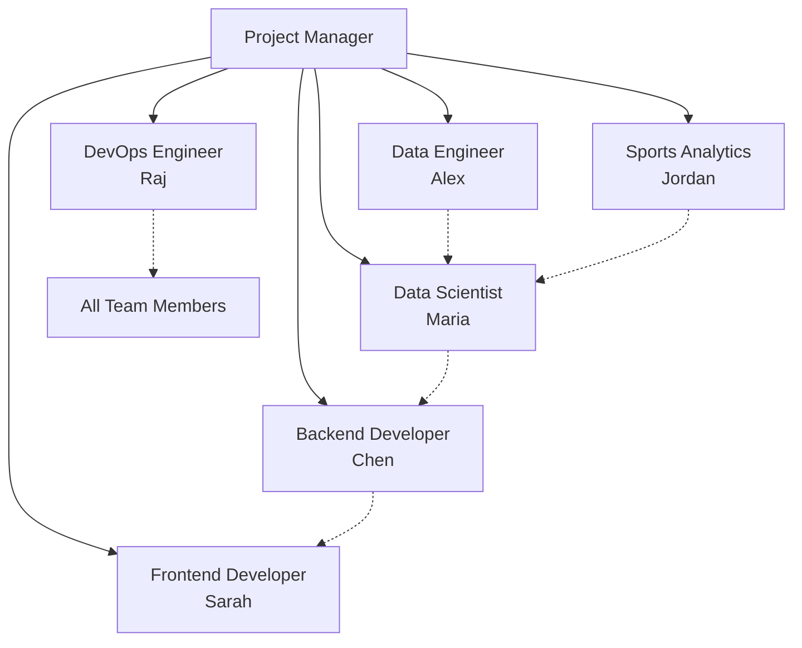

# Team Roles & Responsibilities - Kopitar Project

## Team Structure Overview

---

## 1. Data Engineer - Alex

### Primary Responsibilities
- **Data Architecture**: Design and implement scalable data infrastructure
- **ETL Pipelines**: Build robust data collection and processing systems
- **Data Quality**: Ensure accuracy, completeness, and reliability of all data
- **API Integration**: Manage all external data source connections
- **Performance**: Optimize query performance and data access patterns

### Technical Expertise Required
- **Languages**: Python (expert), SQL (expert), Bash (proficient)
- **Databases**: PostgreSQL, Redis, InfluxDB, MongoDB
- **Tools**: Apache Airflow, Kafka, Spark, dbt
- **Cloud**: AWS (S3, RDS, Lambda), GCP (BigQuery, Dataflow)
- **Other**: Docker, Git, REST APIs, GraphQL

### Key Deliverables
- NHL API client with comprehensive error handling
- Automated data pipeline processing 1000+ games/day
- Real-time streaming infrastructure for live games
- Data quality monitoring dashboard
- Historical data warehouse (3+ seasons)

### Success Metrics
- Data pipeline uptime: >99.5%
- Data freshness: <5 minute lag
- Processing errors: <0.1%
- Query performance: <100ms p95

### Collaboration Requirements
- **With DS**: Provide clean, feature-engineered datasets
- **With SA**: Validate data accuracy and completeness
- **With BE**: Design efficient data access patterns
- **With DO**: Optimize infrastructure costs and performance

### Decision Authority
- Data schema changes
- ETL tool selection
- Data retention policies
- Performance optimization strategies

### Daily Responsibilities
- Monitor data pipeline health
- Investigate data quality issues
- Optimize slow queries
- Review and merge data PRs
- Update data documentation

---

## 2. Data Scientist - Maria

### Primary Responsibilities
- **Statistical Analysis**: Conduct rigorous analysis of fatigue patterns
- **Model Development**: Build predictive models for goalie performance
- **Feature Engineering**: Create meaningful predictive variables
- **Experimentation**: Design and analyze A/B tests
- **Research**: Stay current with sports analytics research

### Technical Expertise Required
- **Languages**: Python (expert), R (proficient), SQL (proficient)
- **ML Libraries**: Scikit-learn, XGBoost, PyTorch, TensorFlow
- **Statistics**: Time series, causal inference, Bayesian methods
- **Tools**: Jupyter, MLflow, Weights & Biases, Git
- **Visualization**: Matplotlib, Seaborn, Plotly, Tableau

### Key Deliverables
- Fatigue prediction model (>75% accuracy)
- Feature importance analysis report
- Model performance monitoring system
- Research paper on findings
- Automated retraining pipeline

### Success Metrics
- Model accuracy: >75% for next-game prediction
- Feature engineering: 50+ validated features
- Model latency: <50ms inference time
- Research impact: 1 published paper

### Collaboration Requirements
- **With SA**: Validate hockey-specific insights
- **With DE**: Define data requirements and quality needs
- **With BE**: Implement model serving infrastructure
- **With FE**: Design intuitive prediction visualizations

### Decision Authority
- Model architecture choices
- Feature selection criteria
- Statistical methodology
- Evaluation metrics

### Daily Responsibilities
- Analyze model performance metrics
- Investigate prediction failures
- Experiment with new features
- Review statistical analyses
- Document findings in notebooks

---

## 3. Sports Analytics Specialist - Jordan

### Primary Responsibilities
- **Domain Expertise**: Provide hockey-specific knowledge and validation
- **Metric Design**: Create meaningful performance indicators
- **Stakeholder Relations**: Interface with NHL teams and coaches
- **Validation**: Ensure all analyses make hockey sense
- **Communication**: Translate technical findings for hockey audience

### Technical Expertise Required
- **Hockey Knowledge**: Deep understanding of goaltending
- **Analytics Tools**: R, Python, Tableau, SportVU
- **Video Analysis**: Hudl, InStat, custom tools
- **Statistics**: Sports-specific methods, survival analysis
- **Communication**: Presentation skills, technical writing

### Key Deliverables
- Validated fatigue metrics framework
- Team adoption playbook
- Case study library (10+ examples)
- Coaching recommendation system
- Conference presentation materials

### Success Metrics
- Stakeholder satisfaction: >4.5/5
- Metric validation: 95% expert agreement
- Team adoption: 10+ NHL teams
- Media coverage: 5+ articles

### Collaboration Requirements
- **With DS**: Validate statistical approaches
- **With DE**: Define hockey-specific data needs
- **With FE**: Design coach-friendly interfaces
- **With BE**: Specify domain-specific APIs

### Decision Authority
- Hockey metric definitions
- Stakeholder communication strategy
- Domain-specific features
- User training content

### Daily Responsibilities
- Review game footage for insights
- Analyze model predictions for accuracy
- Communicate with NHL stakeholders
- Create training materials
- Monitor hockey analytics trends

---

## 4. Backend Developer - Chen

### Primary Responsibilities
- **API Development**: Build robust REST and GraphQL APIs
- **System Architecture**: Design scalable backend services
- **Integration**: Connect ML models with production systems
- **Performance**: Ensure sub-200ms response times
- **Security**: Implement authentication and authorization

### Technical Expertise Required
- **Languages**: Python (expert), Go (proficient), JavaScript
- **Frameworks**: FastAPI, Django, Flask, GraphQL
- **Databases**: PostgreSQL, Redis, Elasticsearch
- **Tools**: Docker, Kubernetes, RabbitMQ, gRPC
- **Testing**: Pytest, Postman, Load testing tools

### Key Deliverables
- Production API with 99.9% uptime
- Comprehensive API documentation
- Authentication/authorization system
- Caching layer implementation
- Webhook notification system

### Success Metrics
- API uptime: >99.9%
- Response time: <200ms p95
- Test coverage: >85%
- Security: Zero breaches

### Collaboration Requirements
- **With DE**: Design data access patterns
- **With DS**: Implement model serving
- **With FE**: Define API contracts
- **With DO**: Optimize deployment

### Decision Authority
- API design patterns
- Technology stack choices
- Caching strategies
- Service architecture

### Daily Responsibilities
- Code review backend PRs
- Monitor API performance
- Debug production issues
- Update API documentation
- Optimize database queries

---

## 5. Frontend Developer - Sarah

### Primary Responsibilities
- **UI/UX Design**: Create intuitive user interfaces
- **Dashboard Development**: Build interactive analytics dashboards
- **Visualization**: Develop compelling data visualizations
- **Mobile Development**: Ensure mobile responsiveness
- **User Testing**: Conduct usability studies

### Technical Expertise Required
- **Languages**: TypeScript, JavaScript, HTML5, CSS3
- **Frameworks**: React, Next.js, React Native
- **State Management**: Redux, MobX, Context API
- **Visualization**: D3.js, Chart.js, Plotly
- **Tools**: Figma, Storybook, Jest, Cypress

### Key Deliverables
- Interactive dashboard with <2s load time
- Mobile application (iOS/Android)
- Component library and design system
- User documentation and tutorials
- Accessibility WCAG 2.1 compliance

### Success Metrics
- Page load time: <2 seconds
- User satisfaction: >4.5/5
- Mobile usage: >30% of traffic
- Accessibility: WCAG 2.1 AA compliant

### Collaboration Requirements
- **With BE**: Define API requirements
- **With DS**: Visualize model outputs
- **With SA**: Design hockey-friendly UX
- **With DO**: Optimize frontend delivery

### Decision Authority
- UI/UX design decisions
- Frontend framework choices
- Component architecture
- Visualization approaches

### Daily Responsibilities
- Implement new features
- Fix UI bugs
- Conduct code reviews
- Update component library
- Monitor user analytics

---

## 6. DevOps Engineer - Raj

### Primary Responsibilities
- **Infrastructure**: Design and maintain cloud infrastructure
- **Automation**: Build CI/CD pipelines and deployment automation
- **Monitoring**: Implement comprehensive monitoring and alerting
- **Security**: Ensure system security and compliance
- **Performance**: Optimize system performance and costs

### Technical Expertise Required
- **Cloud**: AWS (expert), GCP, Azure
- **Containers**: Docker, Kubernetes, Helm
- **IaC**: Terraform, Ansible, CloudFormation
- **Monitoring**: Prometheus, Grafana, ELK stack
- **CI/CD**: GitHub Actions, Jenkins, ArgoCD

### Key Deliverables
- Kubernetes cluster with auto-scaling
- Complete CI/CD pipeline (<15min builds)
- Monitoring dashboard with alerts
- Disaster recovery procedures
- Cost optimization report

### Success Metrics
- System uptime: >99.9%
- Deployment frequency: Daily
- MTTR: <30 minutes
- Infrastructure cost: <$5k/month

### Collaboration Requirements
- **With All**: Provide infrastructure support
- **With BE**: Optimize service deployment
- **With DE**: Scale data infrastructure
- **With FE**: Implement CDN strategy

### Decision Authority
- Infrastructure architecture
- Tool selection for DevOps
- Security policies
- Deployment strategies

### Daily Responsibilities
- Monitor system health
- Respond to alerts
- Review infrastructure PRs
- Optimize costs
- Update runbooks

---

## Communication Matrix

| Meeting | Participants | Frequency | Duration | Purpose |
|---------|-------------|-----------|----------|----------|
| Daily Standup | All | Daily | 15 min | Status updates |
| Technical Sync | DE, DS, BE | 2x/week | 30 min | Technical alignment |
| Design Review | FE, SA, BE | Weekly | 45 min | UX/UI decisions |
| Infrastructure | DO, DE, BE | Weekly | 30 min | Infra planning |
| Sprint Planning | All | Biweekly | 2 hours | Sprint goals |
| Retrospective | All | Biweekly | 1 hour | Process improvement |
| Stakeholder Update | SA, PM | Weekly | 30 min | External comms |

## Escalation Path

1. **Technical Issues**: Team Lead → Tech Lead → CTO
2. **Resource Conflicts**: Team Lead → Project Manager → Director
3. **Scope Changes**: Project Manager → Product Owner → Sponsor
4. **Security Issues**: DevOps → Security Team → CISO

## Tools & Access Requirements

### All Team Members
- GitHub (read/write access)
- Slack (team channels)
- Jira (project access)
- AWS Console (read access)
- Confluence (documentation)

### Role-Specific Access
- **DE**: Full database access, Airflow admin
- **DS**: Jupyter Hub, ML platform access
- **SA**: NHL data access, video analysis tools
- **BE**: API management, Redis admin
- **FE**: Figma, frontend monitoring
- **DO**: Full infrastructure access

## Performance Review Criteria

### Technical Excellence (40%)
- Code quality and best practices
- Technical problem solving
- Innovation and improvements

### Collaboration (30%)
- Team communication
- Knowledge sharing
- Cross-functional work

### Delivery (20%)
- Meeting deadlines
- Quality of deliverables
- Stakeholder satisfaction

### Growth (10%)
- Learning new skills
- Mentoring others
- Industry contributions