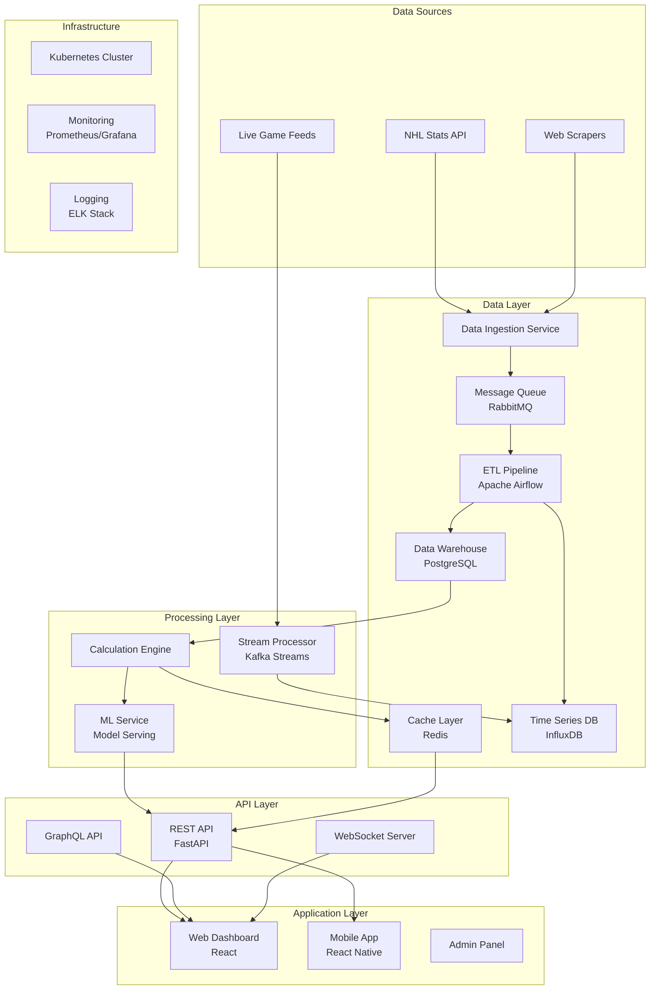

# Technical Architecture - Kopitar System

## System Overview



## Component Architecture

### 1. Data Ingestion Layer

#### NHL API Client
```python
class NHLAPIClient:
    """
    Handles all NHL API interactions with rate limiting and retries
    """
    def __init__(self):
        self.base_url = "https://statsapi.web.nhl.com/api/v1"
        self.rate_limiter = RateLimiter(100, 60)  # 100 req/min
        self.retry_config = RetryConfig(max_retries=3, backoff=2.0)
        
    async def get_game_data(self, game_id: str) -> GameData:
        # Implementation with circuit breaker pattern
        pass
```

**Key Features:**
- Rate limiting: 100 requests/minute
- Exponential backoff retry logic
- Circuit breaker for API failures
- Request caching for frequently accessed data
- Async/await for concurrent requests

#### Web Scraper Service
- Built with Scrapy for robustness
- Rotating proxy support
- JavaScript rendering with Playwright
- Scheduled via Airflow DAGs

### 2. Data Processing Pipeline

#### Apache Airflow Configuration
```yaml
dags:
  - daily_data_collection:
      schedule: "0 6 * * *"  # 6 AM daily
      tasks:
        - fetch_yesterday_games
        - calculate_travel_distances
        - update_fatigue_metrics
        - trigger_model_predictions
        
  - real_time_processing:
      schedule: "*/5 * * * *"  # Every 5 minutes
      tasks:
        - check_live_games
        - update_in_progress_stats
        - send_notifications
```

#### ETL Architecture
```python
# ETL Pipeline Structure
class GoaliePerformanceETL:
    def extract(self) -> pd.DataFrame:
        # Pull from NHL API and staging tables
        pass
        
    def transform(self) -> pd.DataFrame:
        # Calculate derived metrics
        # Apply business rules
        # Data quality checks
        pass
        
    def load(self) -> None:
        # Write to PostgreSQL
        # Update materialized views
        # Invalidate caches
        pass
```

### 3. Database Architecture

#### PostgreSQL Schema Design
```sql
-- Core Tables
CREATE TABLE teams (
    id SERIAL PRIMARY KEY,
    nhl_id INTEGER UNIQUE NOT NULL,
    name VARCHAR(100) NOT NULL,
    abbreviation VARCHAR(3) NOT NULL,
    arena_lat DECIMAL(10, 8),
    arena_lon DECIMAL(11, 8),
    timezone VARCHAR(50)
);

CREATE TABLE players (
    id SERIAL PRIMARY KEY,
    nhl_id INTEGER UNIQUE NOT NULL,
    name VARCHAR(200) NOT NULL,
    position VARCHAR(2) CHECK (position IN ('G', 'D', 'F')),
    birth_date DATE,
    height_cm INTEGER,
    weight_kg INTEGER
);

CREATE TABLE games (
    id SERIAL PRIMARY KEY,
    nhl_id INTEGER UNIQUE NOT NULL,
    date_time TIMESTAMP WITH TIME ZONE NOT NULL,
    home_team_id INTEGER REFERENCES teams(id),
    away_team_id INTEGER REFERENCES teams(id),
    game_type VARCHAR(2),  -- R, P, PR
    status VARCHAR(20)
);

CREATE TABLE goalie_game_stats (
    id SERIAL PRIMARY KEY,
    game_id INTEGER REFERENCES games(id),
    player_id INTEGER REFERENCES players(id),
    team_id INTEGER REFERENCES teams(id),
    time_on_ice INTERVAL,
    shots_against INTEGER,
    saves INTEGER,
    goals_against INTEGER,
    save_percentage DECIMAL(5, 3),
    is_starter BOOLEAN,
    is_home BOOLEAN,
    decision VARCHAR(1)  -- W, L, O, N
);

-- Derived Tables
CREATE TABLE goalie_fatigue_metrics (
    id SERIAL PRIMARY KEY,
    player_id INTEGER REFERENCES players(id),
    game_id INTEGER REFERENCES games(id),
    calculation_time TIMESTAMP DEFAULT NOW(),
    games_last_7d INTEGER,
    games_last_10d INTEGER,
    minutes_last_7d INTEGER,
    travel_miles_last_5d DECIMAL(10, 2),
    days_rest INTEGER,
    is_back_to_back BOOLEAN,
    fatigue_index DECIMAL(5, 2),
    predicted_save_pct DECIMAL(5, 3)
);

-- Indexes for Performance
CREATE INDEX idx_games_date ON games(date_time);
CREATE INDEX idx_goalie_stats_player_date ON goalie_game_stats(player_id, game_id);
CREATE INDEX idx_fatigue_player_game ON goalie_fatigue_metrics(player_id, game_id);
```

#### Redis Cache Structure
```python
# Cache Keys Structure
CACHE_KEYS = {
    "player_recent_stats": "player:{player_id}:stats:recent",
    "team_schedule": "team:{team_id}:schedule:{date}",
    "fatigue_index": "player:{player_id}:fatigue:{date}",
    "predictions": "predictions:{date}:all",
    "live_games": "games:live:stats"
}

# TTL Configuration
CACHE_TTL = {
    "player_recent_stats": 300,  # 5 minutes
    "team_schedule": 3600,  # 1 hour
    "fatigue_index": 600,  # 10 minutes
    "predictions": 1800,  # 30 minutes
    "live_games": 30  # 30 seconds
}
```

### 4. Machine Learning Architecture

#### Model Serving Infrastructure
```python
class ModelServer:
    def __init__(self):
        self.models = {
            "fatigue_predictor": self.load_model("fatigue_v2.3"),
            "performance_ensemble": self.load_ensemble(),
            "injury_risk": self.load_model("injury_v1.1")
        }
        self.feature_pipeline = FeaturePipeline()
        
    async def predict(self, model_name: str, features: dict) -> Prediction:
        # Feature engineering
        processed = self.feature_pipeline.transform(features)
        
        # Model inference
        model = self.models[model_name]
        prediction = model.predict(processed)
        
        # Post-processing
        return self.format_prediction(prediction)
```

#### Model Versioning & A/B Testing
```yaml
model_config:
  fatigue_predictor:
    versions:
      - id: "v2.3"
        weight: 0.8
        features: ["games_7d", "travel_miles", "age"]
      - id: "v2.4-beta"
        weight: 0.2
        features: ["games_7d", "travel_miles", "age", "altitude_change"]
    
  routing_strategy: "weighted_random"
  performance_tracking: true
```

### 5. API Architecture

#### FastAPI Application Structure
```python
# Main API Structure
app = FastAPI(
    title="Kopitar API",
    version="1.0.0",
    docs_url="/api/docs"
)

# Middleware Stack
app.add_middleware(RateLimitMiddleware, calls=1000, period=60)
app.add_middleware(CORSMiddleware, allow_origins=["*"])
app.add_middleware(PrometheusMiddleware)
app.add_middleware(RequestLoggingMiddleware)

# API Endpoints
@app.get("/api/v1/goalies/{goalie_id}/fatigue")
async def get_goalie_fatigue(
    goalie_id: int,
    date: Optional[date] = None,
    db: Session = Depends(get_db),
    cache: Redis = Depends(get_cache)
) -> FatigueResponse:
    # Implementation
    pass

@app.post("/api/v1/predictions/batch")
async def batch_predictions(
    requests: List[PredictionRequest],
    background_tasks: BackgroundTasks
) -> BatchPredictionResponse:
    # Async batch processing
    pass
```

#### GraphQL Schema
```graphql
type Goalie {
  id: ID!
  name: String!
  team: Team!
  recentGames(limit: Int = 10): [GoalieGameStats!]!
  fatigueMetrics(date: Date!): FatigueMetrics
  predictions(upcoming: Int = 5): [PerformancePrediction!]!
}

type FatigueMetrics {
  fatigueIndex: Float!
  gamesLast7Days: Int!
  travelMilesLast5Days: Float!
  daysRest: Int!
  isBackToBack: Boolean!
  components: FatigueComponents!
}

type Query {
  goalie(id: ID!): Goalie
  goaliesByTeam(teamId: ID!): [Goalie!]!
  fatigueRankings(date: Date!, limit: Int = 20): [GoalieFatigueRank!]!
}

type Subscription {
  liveGameUpdates(gameId: ID!): GameUpdate!
  fatigueAlerts(threshold: Float!): FatigueAlert!
}
```

### 6. Frontend Architecture

#### React Application Structure
```typescript
// Component Architecture
src/
├── components/
│   ├── common/
│   ├── charts/
│   │   ├── FatigueTimeline.tsx
│   │   ├── PerformanceScatter.tsx
│   │   └── TravelHeatmap.tsx
│   ├── dashboard/
│   │   ├── GoalieCard.tsx
│   │   ├── TeamDashboard.tsx
│   │   └── LeagueOverview.tsx
│   └── predictions/
├── hooks/
│   ├── useGoalieFatigue.ts
│   ├── useRealtimeUpdates.ts
│   └── usePredictions.ts
├── store/
│   ├── slices/
│   │   ├── goaliesSlice.ts
│   │   ├── predictionsSlice.ts
│   │   └── filtersSlice.ts
│   └── store.ts
└── services/
    ├── api.ts
    ├── websocket.ts
    └── analytics.ts
```

#### State Management
```typescript
// Redux Toolkit Store Configuration
export const store = configureStore({
  reducer: {
    goalies: goaliesReducer,
    predictions: predictionsReducer,
    filters: filtersReducer,
    ui: uiReducer
  },
  middleware: (getDefaultMiddleware) =>
    getDefaultMiddleware()
      .concat(apiMiddleware)
      .concat(websocketMiddleware)
});

// Real-time Updates with WebSocket
const websocketMiddleware: Middleware = (store) => {
  let socket: WebSocket;
  
  return (next) => (action) => {
    switch (action.type) {
      case 'websocket/connect':
        socket = new WebSocket(WS_URL);
        socket.onmessage = (event) => {
          const data = JSON.parse(event.data);
          store.dispatch(updateLiveData(data));
        };
        break;
    }
    return next(action);
  };
};
```

### 7. Infrastructure & Deployment

#### Kubernetes Configuration
```yaml
# Deployment Example
apiVersion: apps/v1
kind: Deployment
metadata:
  name: kopitar-api
spec:
  replicas: 3
  selector:
    matchLabels:
      app: kopitar-api
  template:
    metadata:
      labels:
        app: kopitar-api
    spec:
      containers:
      - name: api
        image: kopitar/api:v1.0.0
        ports:
        - containerPort: 8000
        env:
        - name: DATABASE_URL
          valueFrom:
            secretKeyRef:
              name: kopitar-secrets
              key: database-url
        resources:
          requests:
            memory: "512Mi"
            cpu: "500m"
          limits:
            memory: "1Gi"
            cpu: "1000m"
        livenessProbe:
          httpGet:
            path: /health
            port: 8000
          initialDelaySeconds: 30
          periodSeconds: 10
```

#### Auto-scaling Configuration
```yaml
apiVersion: autoscaling/v2
kind: HorizontalPodAutoscaler
metadata:
  name: kopitar-api-hpa
spec:
  scaleTargetRef:
    apiVersion: apps/v1
    kind: Deployment
    name: kopitar-api
  minReplicas: 3
  maxReplicas: 20
  metrics:
  - type: Resource
    resource:
      name: cpu
      target:
        type: Utilization
        averageUtilization: 70
  - type: Resource
    resource:
      name: memory
      target:
        type: Utilization
        averageUtilization: 80
  - type: Pods
    pods:
      metric:
        name: http_requests_per_second
      target:
        type: AverageValue
        averageValue: "1000"
```

### 8. Monitoring & Observability

#### Metrics Collection
```python
# Prometheus Metrics
from prometheus_client import Counter, Histogram, Gauge

# API Metrics
api_requests_total = Counter(
    'api_requests_total',
    'Total API requests',
    ['method', 'endpoint', 'status']
)

api_request_duration = Histogram(
    'api_request_duration_seconds',
    'API request duration',
    ['method', 'endpoint']
)

# Model Metrics
model_predictions_total = Counter(
    'model_predictions_total',
    'Total model predictions',
    ['model_name', 'version']
)

model_prediction_latency = Histogram(
    'model_prediction_latency_seconds',
    'Model prediction latency',
    ['model_name']
)

# Business Metrics
fatigue_index_current = Gauge(
    'fatigue_index_current',
    'Current fatigue index by goalie',
    ['goalie_id', 'team']
)
```

#### Logging Architecture
```python
# Structured Logging Configuration
import structlog

structlog.configure(
    processors=[
        structlog.stdlib.filter_by_level,
        structlog.stdlib.add_logger_name,
        structlog.stdlib.add_log_level,
        structlog.stdlib.PositionalArgumentsFormatter(),
        structlog.processors.TimeStamper(fmt="iso"),
        structlog.processors.StackInfoRenderer(),
        structlog.processors.format_exc_info,
        structlog.processors.UnicodeDecoder(),
        structlog.processors.JSONRenderer()
    ],
    context_class=dict,
    logger_factory=structlog.stdlib.LoggerFactory(),
    cache_logger_on_first_use=True,
)

# Usage Example
logger = structlog.get_logger()

logger.info(
    "prediction_made",
    goalie_id=goalie_id,
    fatigue_index=fatigue_index,
    predicted_save_pct=prediction,
    model_version="v2.3",
    latency_ms=latency
)
```

### 9. Security Architecture

#### Authentication & Authorization
```python
# JWT-based Authentication
from fastapi_jwt_auth import AuthJWT

class AuthSettings(BaseModel):
    authjwt_secret_key: str = os.getenv("JWT_SECRET_KEY")
    authjwt_algorithm: str = "HS256"
    authjwt_access_token_expires: int = 3600  # 1 hour
    authjwt_refresh_token_expires: int = 604800  # 7 days

@AuthJWT.load_config
def get_config():
    return AuthSettings()

# Role-based Access Control
class Permissions(Enum):
    READ_PUBLIC = "read:public"
    READ_TEAM = "read:team"
    READ_ALL = "read:all"
    WRITE_PREDICTIONS = "write:predictions"
    ADMIN = "admin"

def require_permission(permission: Permissions):
    def decorator(func):
        @wraps(func)
        async def wrapper(*args, **kwargs):
            # Check user permissions
            pass
        return wrapper
    return decorator
```

#### API Security Headers
```python
# Security Middleware
from fastapi.middleware.trustedhost import TrustedHostMiddleware
from secure import SecureHeaders

app.add_middleware(
    TrustedHostMiddleware,
    allowed_hosts=["api.kopitar.com", "*.kopitar.com"]
)

@app.middleware("http")
async def add_security_headers(request: Request, call_next):
    response = await call_next(request)
    secure_headers = SecureHeaders()
    secure_headers.framework.fastapi(response)
    return response
```

### 10. Performance Optimization

#### Database Query Optimization
```sql
-- Materialized View for Fast Lookups
CREATE MATERIALIZED VIEW mv_goalie_recent_performance AS
SELECT 
    p.id as player_id,
    p.name,
    t.abbreviation as team,
    COUNT(DISTINCT g.id) FILTER (WHERE g.date_time > NOW() - INTERVAL '7 days') as games_7d,
    AVG(gs.save_percentage) FILTER (WHERE g.date_time > NOW() - INTERVAL '10 days') as avg_sv_pct_10d,
    SUM(EXTRACT(EPOCH FROM gs.time_on_ice)/60) FILTER (WHERE g.date_time > NOW() - INTERVAL '7 days') as minutes_7d
FROM players p
JOIN goalie_game_stats gs ON p.id = gs.player_id
JOIN games g ON gs.game_id = g.id
JOIN teams t ON gs.team_id = t.id
WHERE p.position = 'G'
  AND g.date_time > NOW() - INTERVAL '30 days'
GROUP BY p.id, p.name, t.abbreviation;

-- Refresh Strategy
CREATE OR REPLACE FUNCTION refresh_goalie_performance()
RETURNS void AS $$
BEGIN
    REFRESH MATERIALIZED VIEW CONCURRENTLY mv_goalie_recent_performance;
END;
$$ LANGUAGE plpgsql;
```

#### Caching Strategy
```python
# Multi-level Caching
class CacheManager:
    def __init__(self):
        self.local_cache = LRUCache(maxsize=1000)
        self.redis_client = Redis(decode_responses=True)
        
    async def get_or_compute(
        self,
        key: str,
        compute_func: Callable,
        ttl: int = 300
    ) -> Any:
        # L1: Local memory cache
        if value := self.local_cache.get(key):
            return value
            
        # L2: Redis cache
        if value := await self.redis_client.get(key):
            self.local_cache[key] = value
            return json.loads(value)
            
        # L3: Compute and cache
        value = await compute_func()
        
        # Cache in both layers
        self.local_cache[key] = value
        await self.redis_client.setex(
            key,
            ttl,
            json.dumps(value)
        )
        
        return value
```

## Disaster Recovery

### Backup Strategy
```yaml
backup_policy:
  databases:
    postgresql:
      full_backup: "0 2 * * *"  # 2 AM daily
      incremental: "0 */6 * * *"  # Every 6 hours
      retention: 30  # days
      
    redis:
      snapshot: "0 */1 * * *"  # Hourly
      retention: 7  # days
      
  storage:
    primary: s3://kopitar-backups/
    secondary: gs://kopitar-backups-dr/
    
  testing:
    recovery_drill: monthly
    rto_target: 1  # hour
    rpo_target: 15  # minutes
```

### Failover Procedures
```python
# Health Check Endpoint
@app.get("/health/detailed")
async def health_check() -> HealthResponse:
    checks = {
        "database": await check_database(),
        "redis": await check_redis(),
        "ml_service": await check_ml_service(),
        "external_apis": await check_external_apis()
    }
    
    status = "healthy" if all(checks.values()) else "unhealthy"
    
    return HealthResponse(
        status=status,
        checks=checks,
        version=APP_VERSION,
        uptime=get_uptime()
    )
```